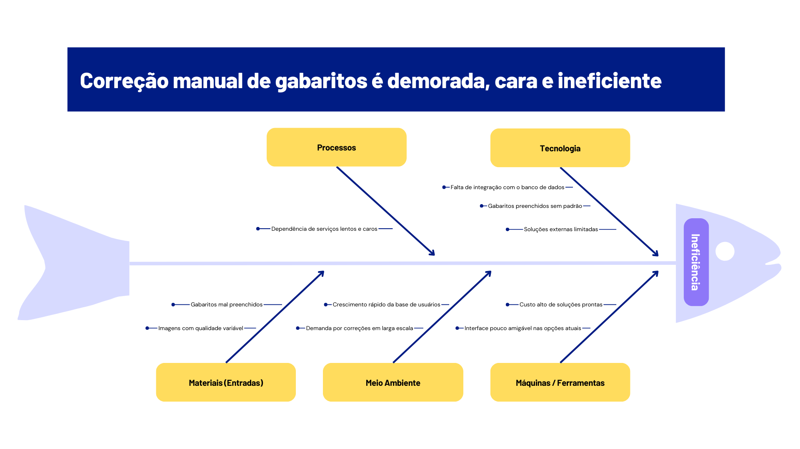

# Cenário Atual

## Introdução ao Negócio e Contexto

A Guia do PAS é uma empresa especializada na preparação de estudantes para o Programa de Avaliação Seriada (PAS) da Universidade de Brasília (UnB), um dos processos seletivos mais concorridos do país. Atuando no setor educacional, a empresa oferece conteúdos direcionados, simulados, correções comentadas, aulas ao vivo e materiais exclusivos, com foco na aprovação dos alunos. A empresa, nos últimos anos, também tem expandido seu mercado para o abranger o atendimento à outras instituições de ensino, oferecendo a aplicação de simulados, listas de exercícios personalizadas e controle de desempenho dos alunos. Além disso, a empresa tem buscado expandir sua atuação para outros processos seletivos além do PAS, visando aumentar sua base de clientes e diversificar seus serviços.

## Identificação da Oportunidade ou Problema

Com o crescimento da base de usuários e o aumento no número de clientes B2B buscando a realização de simulados em suas escolas, percebeu-se algumas dificuldades na obtenção das respostas dos alunos, na inserção desses dados no banco de dados da empresa e a visualização desses dados de forma efetiva pelos coordenadores das escolas parceiras. Após a aplicação do simulado é necessário registrar as respostas de cada aluno e associar esses dados com a matrícula do aluno, utilizando desses dados em uma planilha .csv para ser cadastrada no sistema da empresa. Mesmo fazendo uso de serviços de outras empresas para realizar essa identificação dos gabaritos, essas soluções eram demoradas e muito custosas (demorando mais de um mês para receber os resultados e custando em média R$1500.00 por simulado), não tendo sido possível encontrar uma solução rápida, de fácil uso e barata para a realização de grandes simulados ou de simulados em várias escolas em um curto período de tempo.

A empresa já tentou desenvolver uma solução anteriormente, também chamada Corigge, mas esta primeira versão apresentou diversos problemas técnicos que comprometeram sua utilização efetiva. O sistema anterior, que era uma aplicação web, necessitava de manutenção constante e apresentava várias limitações operacionais: o servidor precisava estar sempre ativo em um computador específico com boa capacidade de processamento, onde um script Python precisava ser executado manualmente para permitir que outros usuários acessassem o sistema. Além disso, o sistema apresentava instabilidades frequentes, com múltiplas ocorrências de crashes tanto no servidor quanto na aplicação, sem mecanismos de auto-recuperação. A necessidade de ajustes manuais de parâmetros pelos usuários finais também se mostrou um obstáculo significativo para a adoção do sistema. A funcionalidade do sistema anterior era limitada apenas à identificação das respostas dos alunos, sem oferecer recursos adicionais como análise de desempenho, geração de relatórios ou personalização de gabaritos.

*Figura: Diagrama de Ishikawa (Espinha de Peixe)*

## Desafios do Projeto

Os principais desafios do projeto são:

- A utilização e parametrização de ferramentas de CV (Visão computacional) para a identificação das respostas dos gabaritos.

- A não padronização dos gabaritos preenchidos pelos alunos

- A não familiaridade de alguns membros da equipe com as ferramentas a serem utilizadas

- A criação de um design amigável, eficiente e intuitivo para a utilização pelos membros da empresa

- O empacotamento das ferramentas necessárias para integrar o CV em uma aplicação multiplataforma em flutter

## Segmentação de Clientes

O público alvo atual da empresa são alunos do ensino médio e alunos de cursinhos que buscam uma preparação estratégica e eficiente para o PAS, além de instituições de ensino que desejam ter uma preparação mais específica para o PAS e simulados personalizados para esta preparação.

O perfil dos alunos é de jovens entre 15 e 20 anos, que buscam uma preparação diferenciada para o PAS, com foco em resultados e aprovação. Eles valorizam a qualidade do conteúdo, a eficiência dos simulados e a possibilidade de acompanhar seu desempenho ao longo do tempo.

O perfil dos coordenadores das instituições de ensino são profissionais com formação superior, que atuam na área de educação e buscam soluções tecnológicas para otimizar a gestão acadêmica e melhorar a experiência dos alunos. Eles valorizam a eficiência e a facilidade de uso das ferramentas que utilizam.

## Necessidades dos Stakeholders

### Professores
- Redução do tempo gasto em correções
- Acesso rápido aos resultados dos alunos
- Identificação de padrões de erro
- Ferramentas para análise de desempenho

### Coordenadores
- Visão geral do desempenho das turmas
- Relatórios detalhados de progresso
- Identificação de áreas que precisam de atenção
- Gestão eficiente do processo de avaliação

### Alunos
- Feedback rápido sobre seu desempenho
- Acesso a análises individuais
- Identificação de pontos de melhoria
- Acompanhamento do progresso

## Histórico de Versão

| Data       | Versão | Descrição                       | Autor(es)      | Revisor(es) |
| ---------- | ------ | ------------------------------- | -------------- | ----------- |
| 19/04/2025 | 1.0    | Criação inicial da documentação | Marcelo Adrian | Nathan Abreu|