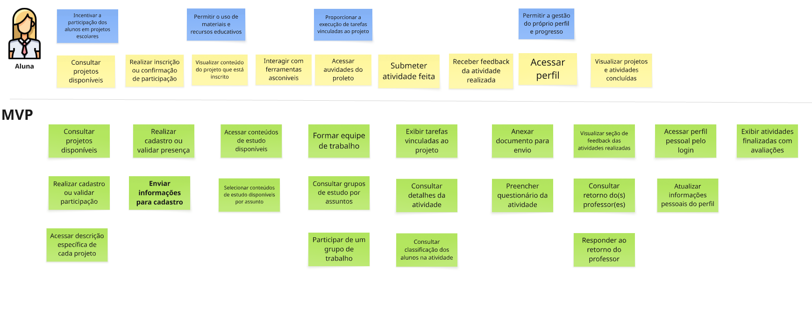

# PBB Canvas

O PBB Canvas (Product Backlog Building Canvas) é uma ferramenta visual e colaborativa para ajudar equipes a criar e organizar o backlog de um produto de forma estruturada.

Em resumo, ele funciona como um mapa que guia a transformação de uma ideia em tarefas concretas para o time de desenvolvimento. O processo segue os seguintes passos:

- Define-se o Problema que o produto resolve e as Expectativas de negócio.
- Identificam-se as Personas (os tipos de usuários).
- Listam-se as Features (as grandes funcionalidades) que cada persona usará.
- Quebram-se as features em PBIs (Product Backlog Items), que são as tarefas menores e detalhadas.

A grande vantagem é que, ao final, a equipe tem todos os elementos para escrever Histórias de Usuário de forma clara e completa, pois o canvas já responde quem quer (a Persona), o quê quer (o PBI) e por que quer (a Expectativa).

**Resumo do Produto: HealthNet**

Contexto:
A "HealthNet" é uma ampla rede de clínicas e hospitais que enfrenta desafios operacionais críticos devido à sua infraestrutura tecnológica fragmentada. Atualmente, a rede opera com múltiplos sistemas desatualizados e incompatíveis entre si, resultando em prontuários de pacientes isolados, processos manuais ineficientes e uma comunicação deficiente entre as suas diversas unidades e profissionais.

Problema Central:
A falta de um sistema unificado gera uma série de problemas:

- Atrasos e Risco Clínico: Médicos e recepcionistas perdem um tempo precioso para aceder a históricos completos dos pacientes, aumentando o risco de erros médicos por falta de informação.
- Ineficiência Operacional: Processos como agendamento de consultas e dispensação de medicamentos são lentos, propensos a erros e geram frustração tanto para os funcionários (médicos, farmacêuticos, coordenadores) quanto para os pacientes.
- Experiência do Paciente Negativa: Os pacientes sentem-se desinformados, sem um acesso fácil e centralizado ao seu próprio histórico de saúde, resultados de exames ou agendamentos.

Solução Proposta:
O produto a ser construído é um Sistema de Gestão Integrado HealthNet, uma plataforma de software moderna e centralizada, desenhada para resolver os problemas fundamentais da rede. O objetivo é unificar a gestão de dados e otimizar os fluxos de trabalho, focando em funcionalidades-chave como:

- Gestão de Prontuário Eletrónico do Paciente (PEP)
- Agendamento Inteligente de Consultas
- Sistema de Prescrição e Farmácia Integrado
- Portal do Paciente

<iframe width="768" height="432" src="https://miro.com/app/live-embed/uXjVIm4FXpA=/?embedMode=view_only_without_ui&moveToViewport=-10835,-12450,20026,11592&embedId=249665201455" frameborder="0" scrolling="no" allow="fullscreen; clipboard-read; clipboard-write" allowfullscreen></iframe>

**Prints do Projeto**

**Personas**

  
  
  
  
  
  

**Funcionalidades**

  
  
  
  
  
  

**Product Backlog Item - PBI**

  
  
  
  
  
  

### 1. Persona: Dr. João (Médico Clínico Geral)

-   ***Funcionalidade:*** *Gestão de Prontuário Eletrônico do Paciente (PEP)*

| Código US | Título | História de Usuário |
| :--- | :--- | :--- |
| US 2.1 | Acessar histórico completo do paciente | Como Médico, quero ter acesso rápido e completo ao histórico unificado do paciente, para obter uma visão integral do seu quadro clínico e tomar decisões mais assertivas e seguras. |
| US 2.2 | Receber alertas de segurança na prescrição | Como Médico, quero receber alertas automáticos sobre interações medicamentosas e alergias do paciente durante a prescrição, para garantir a segurança do tratamento e evitar reações adversas. |

### 2. Persona: Maria (Recepcionista)

-   ***Funcionalidade:*** *Gestão de Admissão e Cadastro de Pacientes*

| Código US | Título | História de Usuário |
| :--- | :--- | :--- |
| US 2.3 | Registrar novo paciente com agilidade | Como Recepcionista, quero registrar novos pacientes de forma rápida e intuitiva, para reduzir o tempo de espera na recepção e otimizar o fluxo de atendimento. |
| US 2.4 | Atualizar dados de forma centralizada | Como Recepcionista, quero atualizar as informações dos pacientes em um sistema centralizado, incluindo dados de outras unidades, para garantir a precisão cadastral sem atrasos. |

### 3. Persona: Lívia (Farmacêutica)

-   ***Funcionalidade:*** *Sistema de Prescrição e Farmácia Integrado*

| Código US | Título | História de Usuário |
| :--- | :--- | :--- |
| US 2.5 | Receber prescrições digitais | Como Farmacêutica, quero receber as prescrições médicas de forma digital e clara diretamente no sistema, para eliminar erros de legibilidade e agilizar a dispensação. |
| US 2.6 | Validar segurança da dispensação | Como Farmacêutica, quero que o sistema me alerte sobre possíveis interações medicamentosas e alergias do paciente, para realizar uma dispensação à prova de erros e orientar o paciente corretamente. |
| US 2.7 | Registrar dispensação de medicamentos | Como Farmacêutica, quero registrar a dispensação de medicamentos de forma digital e integrada ao prontuário, para manter um histórico preciso e auxiliar no controle de estoque. |

### 4. Persona: Rafael (Coordenador de Agendamento)

-   ***Funcionalidade:*** *Agendamento Inteligente de Consultas*

| Código US | Título | História de Usuário |
| :--- | :--- | :--- |
| US 2.8 | Visualizar agenda médica unificada | Como Coordenador de Agendamento, quero visualizar a disponibilidade de todos os médicos em uma agenda unificada e integrada, para otimizar a distribuição de consultas e facilitar reagendamentos. |
| US 2.9 | Enviar notificações automáticas | Como Coordenador de Agendamento, quero que o sistema envie notificações e lembretes automáticos aos pacientes, para reduzir a taxa de não comparecimento e melhorar a eficiência da agenda. |

### 5. Persona: Sra. Clara (Paciente)

-   ***Funcionalidade:*** *Portal do Paciente*

| Código US | Título | História de Usuário |
| :--- | :--- | :--- |
| US 2.10 | Agendar consultas online | Como Paciente, quero poder agendar minhas próprias consultas de forma online através de um portal, para ter mais autonomia e conveniência. |
| US 2.11 | Acessar informações de saúde | Como Paciente, quero ter acesso fácil e seguro aos meus resultados de exames e histórico de saúde no portal, para acompanhar meu tratamento e gerenciar minhas informações. |

### 6. Persona: Sr. Roberto (Diretor de Tecnologia)

-   ***Funcionalidade:*** *Administração, Segurança e Relatórios do Sistema*

| Código US | Título | História de Usuário |
| :--- | :--- | :--- |
| US 2.12 | Garantir conformidade e segurança dos dados | Como Diretor de Tecnologia, quero que a solução garanta a segurança dos dados e esteja em total conformidade com as regulamentações vigentes, como a LGPD, para proteger a clínica e seus pacientes. |
| US 2.13 | Monitorar desempenho e gerar relatórios | Como Diretor de Tecnologia, quero ter acesso a ferramentas de monitoramento de desempenho e geração de relatórios, para garantir a estabilidade do sistema e extrair dados para decisões estratégicas. |

### Requisitos, Critérios e Cenários BDD - HealthNet
---
#### US01: Acessar prontuário eletrônico unificado
> "Eu, como médico, quero acessar um prontuário eletrônico unificado, para que eu tenha uma visão completa do histórico clínico dos pacientes, independentemente da unidade onde foram atendidos."

**Critérios de Aceitação:**
- O sistema deve exibir o histórico completo do paciente, incluindo registros de diferentes unidades.
- Se o paciente não possuir registros, o sistema deve exibir um prontuário vazio com uma mensagem de aviso.
- A busca por pacientes deve ser feita de forma unificada entre unidades.
- O acesso ao prontuário exige autenticação de um usuário médico.

**Cenários de BDD:**
- **CENÁRIO 1: Acesso ao prontuário com histórico de múltiplas unidades**
  - **Dado que** o médico Dr. Carlos está autenticado no sistema da HealthNet na "Unidade A".
  - **E que** o paciente "José da Silva" possui um histórico de consultas na "Unidade A" e um registro de exame de imagem na "Unidade B".
  - **Quando** o Dr. Carlos pesquisar pelo paciente "José da Silva" e acessar seu prontuário.
  - **Então** o sistema deve exibir a lista de consultas realizadas na "Unidade A".
  - **E** o sistema deve também exibir o registro do exame de imagem realizado na "Unidade B".

- **CENÁRIO 2: Acesso ao prontuário de um paciente novo**
  - **Dado que** o médico está autenticado no sistema.
  - **E que** o paciente "Mariana Costa" é novo e não possui registros clínicos anteriores.
  - **Quando** o médico acessar o prontuário de "Mariana Costa".
  - **Então** o sistema deve exibir um prontuário vazio com uma mensagem indicando "Nenhum registro clínico encontrado para este paciente".

---
#### US02: Interface rápida de agendamento
> "Eu, como coordenador de agendamento, quero uma interface rápida de agendamento, para que eu otimize a marcação de consultas e reduza o tempo de espera dos pacientes."

**Critérios de Aceitação:**
- A interface deve permitir selecionar paciente, médico e horário disponíveis.
- Ao confirmar, a consulta deve ser registrada imediatamente na agenda do médico.
- Horários ocupados devem ser bloqueados para novo agendamento.
- O sistema deve exibir mensagem de erro ao tentar agendar em horário já ocupado.

**Cenários de BDD:**
- **CENÁRIO 1: Agendamento rápido de uma nova consulta**
  - **Dado que** o coordenador de agendamento está na "Interface de Agendamento Rápido".
  - **Quando** ele selecionar o paciente "Ana Souza", o médico "Dr. Silva" e o horário disponível "10:30 de 24/06/2025".
  - **E** clicar em "Confirmar Agendamento".
  - **Então** a consulta deve ser criada imediatamente na agenda do "Dr. Silva".
  - **E** o horário de "10:30 de 24/06/2025" deve aparecer como "ocupado".

- **CENÁRIO 2: Tentativa de agendamento em horário já ocupado**
  - **Dado que** o coordenador está na interface de agendamento.
  - **E que** o horário das 11:00 do Dr. Silva já está ocupado.
  - **Quando** ele tentar agendar um novo paciente para o Dr. Silva às 11:00.
  - **Então** o sistema deve exibir uma mensagem de erro "Este horário não está mais disponível. Por favor, selecione outro." e não deve permitir o agendamento.

---
#### US03: Prescrever medicamentos digitalmente com alertas
> "Eu, como médico, quero prescrever medicamentos digitalmente com alertas, para que eu seja avisado sobre interações perigosas e erros de dosagem."

**Critérios de Aceitação:**
- O sistema deve emitir alertas ao detectar interação entre medicamentos.
- Alertas de interação devem ter níveis de criticidade (alta, média, baixa).
- Alertas de alergia registrada devem ser exibidos com destaque.
- A prescrição só deve ser confirmada após a ciência do médico sobre o alerta.

**Cenários de BDD:**
- **CENÁRIO 1: Prescrição com interação medicamentosa de alta criticidade**
  - **Dado que** o médico está autenticado no sistema da HealthNet,
  - **E que** está prescrevendo "Medicamento A" que interage de forma crítica com o "Medicamento B" já em uso pelo paciente,
  - **Quando** o médico adicionar "Medicamento A" à prescrição,
  - **Então** o sistema deve exibir um alerta de criticidade alta com a mensagem: "Interação perigosa detectada entre Medicamento A e B. Risco grave para o paciente."
  - **E** exigir que o médico confirme ciência do alerta antes de prosseguir.

- **CENÁRIO 2: Prescrição para paciente com alergia registrada**
  - **Dado que** o paciente possui alergia a "Amoxicilina" registrada em seu prontuário,
  - **Quando** o médico tentar prescrever "Amoxicilina",
  - **Então** o sistema deve exibir um alerta visual destacado com a mensagem: "Atenção: Alergia registrada à Amoxicilina. Prescrição não recomendada."
  - **E** bloquear a prescrição até que o médico altere ou confirme ciência.

---
#### US04: Gerar relatórios automáticos de conformidade
> "Eu, como diretor de tecnologia, quero gerar relatórios automáticos de conformidade, para que eu cumpra as exigências regulatórias com precisão e menos esforço."

**Critérios de Aceitação:**
- A funcionalidade deve estar disponível apenas para perfis de administrador.
- Os relatórios devem ser gerados em PDF contendo trilhas de auditoria.
- Usuários sem permissão devem receber a mensagem de acesso negado.
- O relatório deve ser gerado a partir de parâmetros configuráveis (ex: período).

**Cenários de BDD:**
- **CENÁRIO 1: Geração de relatório com sucesso por administrador**
  - **Dado que** o usuário "João Silva" está autenticado como administrador,
  - **Quando** ele acessar a funcionalidade de "Relatórios de Conformidade",
  - **E** configurar o período de 01/01/2025 a 30/06/2025,
  - **E** clicar em "Gerar PDF",
  - **Então** o sistema deve gerar e disponibilizar um arquivo PDF com trilha de auditoria referente ao período solicitado.

- **CENÁRIO 2: Tentativa de acesso por usuário sem permissão**
  - **Dado que** o usuário "Maria Rocha" está autenticado como recepcionista,
  - **Quando** ela tentar acessar a funcionalidade de "Relatórios de Conformidade",
  - **Então** o sistema deve exibir a mensagem: "Acesso negado. Esta funcionalidade está disponível apenas para administradores."

---
#### US05: Acessar informações de saúde via portal
> "Eu, como paciente, quero acessar minhas informações de saúde via portal, para que eu acompanhe meu tratamento com mais autonomia."

**Critérios de Aceitação:**
- O acesso deve ser feito com CPF e senha cadastrados.
- O sistema deve validar as credenciais e exibir mensagens claras de erro em caso de falha.
- Após login, o paciente deve ser redirecionado ao painel de informações.
- O sistema deve garantir segurança e privacidade dos dados acessados.

**Cenários de BDD:**
- **CENÁRIO 1: Acesso bem-sucedido ao portal do paciente**
  - **Dado que** o paciente "Carlos Mendes" possui CPF e senha cadastrados,
  - **Quando** ele acessar o portal e inserir suas credenciais corretamente,
  - **Então** o sistema deve validá-las,
  - **E** redirecionar o paciente para o painel com informações de saúde (consultas, exames e prescrições).

- **CENÁRIO 2: Tentativa de login com senha incorreta**
  - **Dado que** o paciente insere um CPF válido e uma senha incorreta,
  - **Quando** clicar em "Entrar",
  - **Então** o sistema deve exibir a mensagem: "Credenciais inválidas. Por favor, verifique seu CPF e senha."

---
#### US06: Garantir controle seguro aos dados dos pacientes
> "Eu, como diretor de tecnologia, quero garantir controle seguro aos dados dos pacientes, para que a rede esteja em conformidade com a LGPD e evite vazamentos."

**Critérios de Aceitação:**
- Perfis de acesso devem restringir funcionalidades conforme o cargo do usuário.
- Tentativas de acesso indevido devem ser registradas em log de segurança.
- O sistema deve forçar logout após 30 minutos de inatividade.
- Após logout, qualquer nova ação deve redirecionar à tela de login.

**Cenários de BDD:**
- **CENÁRIO 1: Tentativa de acesso não autorizado**
  - **Dado que** o usuário "Pedro Lima" tem perfil de recepcionista,
  - **Quando** ele tentar acessar a tela de prescrição de medicamentos,
  - **Então** o sistema deve negar o acesso e registrar a tentativa em um log de segurança.

- **CENÁRIO 2: Sessão expirada após inatividade**
  - **Dado que** a médica "Dra. Renata" está logada no sistema,
  - **E que** está inativa há mais de 30 minutos,
  - **Quando** tentar acessar qualquer funcionalidade,
  - **Então** o sistema deve redirecioná-la automaticamente para a tela de login com a mensagem: "Sessão expirada por inatividade."

---
#### US07: Registrar e atualizar dados dos pacientes
> "Eu, como recepcionista, quero registrar e atualizar os dados dos pacientes com facilidade, para que o atendimento seja mais rápido e confiável."

**Critérios de Aceitação:**
- O sistema deve permitir edição dos dados dos pacientes.
- Mudanças devem ser salvas apenas após validação de campos obrigatórios.
- Deve ser exibida mensagem de sucesso ao salvar corretamente.
- Campos obrigatórios em branco devem gerar mensagens de erro específicas.

**Cenários de BDD:**
- **CENÁRIO 1: Atualização bem-sucedida de cadastro**
  - **Dado que** a recepcionista está na tela de edição do paciente "Joana Freitas",
  - **E que** todos os campos obrigatórios foram preenchidos corretamente,
  - **Quando** ela clicar em "Salvar",
  - **Então** o sistema deve salvar as alterações e exibir a mensagem: "Dados atualizados com sucesso."

- **CENÁRIO 2: Tentativa de salvar com campos obrigatórios em branco**
  - **Dado que** a recepcionista deixou o campo "CPF" em branco,
  - **Quando** clicar em "Salvar",
  - **Então** o sistema deve exibir a mensagem de erro: "O campo CPF é obrigatório."
  - **E** não deve permitir o salvamento dos dados.

---
#### US08: Agendar consultas em diferentes unidades
> "Eu, como paciente, quero agendar consultas em diferentes unidades da HealthNet, para que eu tenha mais flexibilidade e praticidade nos meus atendimentos."

**Critérios de Aceitação:**
- O sistema deve permitir busca por especialidade e unidade.
- Se a especialidade não estiver disponível, o sistema deve sugerir outras unidades.
- Ao confirmar o agendamento, ele deve estar visível tanto para o paciente quanto para a unidade.
- O paciente pode consultar os agendamentos futuros em qualquer unidade.

**Cenários de BDD:**
- **CENÁRIO 1: Agendamento em unidade alternativa**
  - **Dado que** o paciente procura por um cardiologista na "Unidade A",
  - **E que** a especialidade não está disponível nessa unidade,
  - **Quando** realizar a busca,
  - **Então** o sistema deve sugerir a "Unidade B" que possui cardiologistas disponíveis,
  - **E** permitir o agendamento direto nela.

- **CENÁRIO 2: Visualização de agendamentos futuros**
  - **Dado que** o paciente "Lucas Ribeiro" está logado no portal,
  - **Quando** acessar "Meus Agendamentos",
  - **Então** o sistema deve exibir a lista de consultas futuras agendadas em todas as unidades da rede HealthNet.

---
#### US09: Registrar entrega de medicamentos
> "Eu, como farmacêutica, quero registrar automaticamente os medicamentos que entrego, para que eu controle melhor o estoque e o histórico do paciente."

**Critérios de Aceitação:**
- O sistema deve registrar a entrega com base na prescrição digital.
- O status do medicamento deve mudar para 'Dispensado' após registro.
- O estoque deve ser automaticamente decrementado.
- Se não houver estoque, a entrega deve ser bloqueada e exibir erro.

**Cenários de BDD:**
- **CENÁRIO 1: Registro automático de medicamento entregue**
  - **Dado que** o paciente possui uma prescrição ativa de "Paracetamol 750mg",
  - **E que** há estoque disponível,
  - **Quando** a farmacêutica registrar a entrega,
  - **Então** o status do medicamento na prescrição deve ser atualizado para "Dispensado",
  - **E** a quantidade correspondente no estoque deve ser automaticamente reduzida.

- **CENÁRIO 2: Tentativa de entrega sem estoque disponível**
  - **Dado que** a prescrição solicita "Amoxicilina",
  - **E que** o estoque está zerado,
  - **Quando** a farmacêutica tentar registrar a entrega,
  - **Então** o sistema deve exibir a mensagem: "Medicamento indisponível no estoque. Entrega não realizada."

---
#### US10: Painel com indicadores de desempenho
> "Eu, como diretor de tecnologia, quero um painel com indicadores de desempenho, para que eu acompanhe a eficiência do sistema e das unidades da rede."

**Critérios de Aceitação:**
- O painel deve conter gráficos de desempenho por unidade.
- Métricas como tempo médio de espera e número de atendimentos devem estar visíveis.
- O usuário deve poder aplicar filtros por período (ex: últimos 7 dias).
- Os gráficos devem atualizar automaticamente ao aplicar filtros.

**Cenários de BDD:**
- **CENÁRIO 1: Visualização de indicadores por unidade**
  - **Dado que** o usuário está autenticado como administrador,
  - **Quando** acessar o Painel de Indicadores,
  - **E** selecionar a unidade "Unidade Central",
  - **Então** o sistema deve exibir os gráficos de desempenho dessa unidade, incluindo tempo médio de espera e número de atendimentos.

- **CENÁRIO 2: Aplicação de filtros temporais nos dados**
  - **Dado que** o usuário está no Painel de Indicadores,
  - **Quando** aplicar o filtro "últimos 7 dias",
  - **Então** os gráficos e métricas devem ser atualizados automaticamente para refletir os dados do período selecionado.

Após a construção do Product Backlog Building (PBB) Canvas, obtivemos uma visão estratégica e holística do produto "HealthNet". Mapeámos os problemas, as expectativas, as personas, as funcionalidades essenciais e os Itens do Backlog do Produto (PBIs) que definem o que precisa de ser construído e porquê.

No entanto, para garantir que a equipa de desenvolvimento construa as funcionalidades exatamente como foram idealizadas, precisamos de traduzir estes requisitos de alto nível em especificações de comportamento claras e testáveis. É aqui que o Behavior-Driven Development (BDD) entra como o próximo passo natural e lógico.

O BDD preenche a lacuna entre a estratégia do PBB e a execução técnica. Partindo dos elementos que já definimos:

- A Persona do PBB diz-nos "Quem?" (o ator da história).
- O PBI (Item do Backlog) diz-nos "O Quê?" (a ação desejada).
- O Benefício da funcionalidade diz-nos "Porquê?" (o valor gerado).

Estes três componentes formam a base para as Histórias de Usuário. Por sua vez, cada História de Usuário é detalhada através de Cenários de Aceitação escritos no formato Dado-Quando-Então. Estes cenários descrevem exemplos concretos do comportamento esperado do sistema, eliminando ambiguidades e criando uma linguagem comum entre gestores, desenvolvedores e analistas de qualidade.

A seguir, demonstraremos este processo em prática, detalhando as Histórias de Usuário e os cenários BDD para as funcionalidades priorizadas, garantindo assim que a visão estratégica do PBB se transforme em funcionalidades precisas e de alto valor.

[Documento BDD](https://docs.google.com/document/d/19XinDfzDs0-kPgJbNHZBzaNBkR8u4V5YjolIq0tVLD0/edit?usp=sharing)
