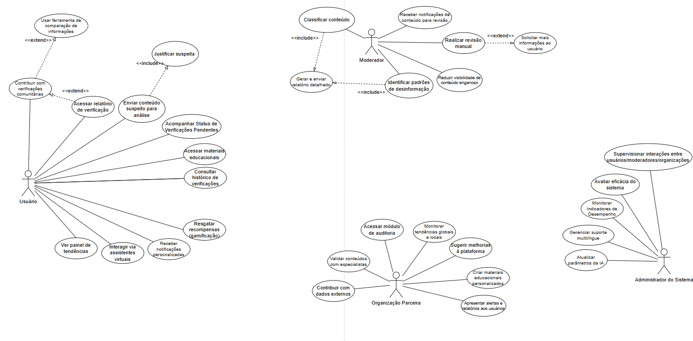

# UML Verify

O Verify é uma plataforma digital desenvolvida para combater a crescente onda de desinformação na sociedade. Sua proposta é identificar, analisar e mitigar a propagação de notícias falsas por meio de inteligência artificial e da colaboração entre usuários e especialistas em checagem de fatos.

**Prints do Projeto**

### Especificação de Caso de Uso: Enviar Conteúdo Suspeito para Análise

#### 1. Breve Descrição
Este caso de uso permite que o Usuário da plataforma "Verify" envie conteúdos que considera suspeitos (como textos, links, imagens ou vídeos) para que o sistema realize uma análise de veracidade. O objetivo é iniciar o processo de verificação, que pode envolver tanto a análise por inteligência artificial quanto a revisão manual por moderadores.

#### 2. Pré-Condições
* **PC-1:** O Usuário deve ter acesso à plataforma "Verify", seja pelo aplicativo instalado, web, ou por meio de um dos canais integrados (chatbot, extensão de navegador, etc.).

#### 3. Fluxo Básico de Eventos (FB)
Este caso de uso é iniciado quando o Usuário decide enviar um conteúdo para análise.

1.  O Usuário aciona a funcionalidade de envio de conteúdo na interface principal do "Verify".
2.  O sistema apresenta a interface de submissão, solicitando que o Usuário insira o conteúdo suspeito.
3.  O Usuário insere o conteúdo no formato de texto, cola um link (URL) ou realiza o upload de um arquivo de mídia (imagem ou vídeo).
4.  O sistema executa uma validação preliminar de formato e integridade no conteúdo inserido. (Tratado em **FE01**, **FE03**).
5.  O sistema executa uma verificação de duplicidade em tempo real, comparando o conteúdo com o banco de dados. (Tratado em **FE05**).
6.  O sistema solicita que o Usuário justifique o motivo da suspeita, apresentando uma lista de categorias predefinidas e uma opção para texto livre. (Inclui o caso de uso "Justificar Suspeita"; tratado em **FA05**).
7.  O Usuário seleciona uma ou mais justificativas ou insere uma descrição textual.
8.  O Usuário confirma a submissão.
9.  O sistema executa uma análise preliminar automatizada utilizando seu motor de Inteligência Artificial.
10. O sistema registra a solicitação de forma persistente em seu banco de dados, associando-a ao Usuário, conteúdo, justificativa e resultados da IA.
11. O sistema gera um número de protocolo único para acompanhamento.
12. O sistema exibe uma mensagem de confirmação ao Usuário, informando o recebimento com sucesso e o número do protocolo.
13. O sistema oferece opções interativas, como ser notificado sobre o resultado da análise. (Ponto de extensão para **PE-01**).
14. O caso de uso é encerrado com sucesso.

#### 4. Fluxos Alternativos (FA)

* **[FA01] Envio via Integração com Chatbot**
    * **Condição:** O Usuário interage com o chatbot oficial do "Verify" em um aplicativo de mensagens.
    * 1. No passo 1 do FB, o Usuário encaminha o conteúdo para o contato do chatbot.
    * 2. O chatbot confirma o recebimento e conduz um diálogo para obter a justificativa da suspeita.
    * 3. O fluxo converge e continua a partir do passo 9 do FB.

* **[FA02] Envio via Extensão de Navegador**
    * **Condição:** O Usuário utiliza a extensão do "Verify" em uma página da web.
    * 1. No passo 1 do FB, o Usuário clica com o botão direito no conteúdo e seleciona "Verificar com Verify".
    * 2. A extensão abre uma interface já preenchida com o conteúdo selecionado.
    * 3. O fluxo converge e continua a partir do passo 6 do FB.

* **[FA03] Envio via Integração com Redes Sociais**
    * **Condição:** O Usuário está em uma rede social com integração nativa do "Verify".
    * 1. No passo 1 do FB, o Usuário clica no botão "Verificar Informações" da postagem.
    * 2. O sistema captura o conteúdo relevante via API e apresenta uma interface simplificada para justificativa.
    * 3. O fluxo converge e continua a partir do passo 7 do FB.

* **[FA04] Envio via Assistente Virtual (Alexa, Google Assistant, etc.)**
    * **Condição:** O Usuário utiliza a skill/ação do "Verify" em um assistente de voz.
    * 1. No passo 1 do FB, o Usuário profere um comando de voz para enviar o conteúdo.
    * 2. O assistente de voz confirma o recebimento e pode perguntar a justificativa.
    * 3. O fluxo converge e continua a partir do passo 9 do FB. A confirmação e protocolo são entregues por voz.

* **[FA05] Envio de Conteúdo com Justificativa Aberta**
    * **Condição:** No passo 6 do FB, o Usuário escolhe descrever a suspeita com suas próprias palavras.
    * 1. O sistema exibe um campo de texto para a entrada da justificativa.
    * 2. O Usuário digita o motivo detalhado.
    * 3. O fluxo converge e continua no passo 8 do FB.

#### 5. Fluxos de Exceção (FE)

* **[FE01] Conteúdo Inválido ou Mal Formatado**
    * **Condição:** No passo 4 do FB, a validação do conteúdo falha (ex: URL quebrado).
    * 1. O sistema exibe uma mensagem de erro clara e impede a continuação.
    * 2. O sistema retorna ao passo 3 do FB, permitindo que o Usuário corrija a entrada.

* **[FE02] Falha na Conexão com o Servidor**
    * **Condição:** Em qualquer passo que exija comunicação com o servidor.
    * 1. Se a funcionalidade offline estiver ativa, o sistema armazena a solicitação em uma fila local no dispositivo e notifica o usuário. O caso de uso termina (para o usuário).
    * 2. Se a funcionalidade offline não estiver ativa, o sistema informa sobre a falha e sugere tentar novamente mais tarde, sem perder os dados inseridos.

* **[FE03] Formato de Arquivo Não Suportado**
    * **Condição:** No passo 3 do FB, o Usuário tenta fazer upload de um tipo de arquivo não permitido.
    * 1. O sistema rejeita o upload e exibe uma mensagem de erro com os formatos válidos.
    * 2. O sistema retorna ao passo 3 do FB.

* **[FE04] Limite de Submissões Excedido**
    * **Condição:** No passo 8 do FB, o sistema detecta que o Usuário (ou IP) excedeu a taxa de submissões permitida.
    * 1. O sistema bloqueia a submissão e exibe uma mensagem explicando a política anti-spam.
    * 2. O caso de uso é encerrado.

* **[FE05] Conteúdo Duplicado**
    * **Condição:** No passo 5 do FB, o sistema identifica que o conteúdo já foi submetido.
    * 1. O sistema interrompe a submissão e informa que o conteúdo já está no sistema.
    * 2. O sistema apresenta o status atual da verificação ("Em análise" ou "Verificação concluída") e, se disponível, fornece um link direto para o relatório.

#### 6. Pós-Condições

* **Sucesso:**
    * Uma nova solicitação de verificação é registrada no banco de dados com um protocolo único.
    * O conteúdo submetido é armazenado de forma segura.
    * A solicitação é inserida na fila de processamento da IA e, se necessário, na fila de trabalho dos Moderadores.
    * O Usuário recebe uma confirmação com o número do protocolo.

* **Falha:**
    * O estado do sistema permanece inalterado. Nenhuma solicitação é criada.
    * O Usuário é informado sobre o motivo da falha.

* **Submissão em Fila (Offline):**
    * A solicitação de verificação é armazenada de forma segura em uma fila local no dispositivo do Usuário.
    * O estado do servidor permanece inalterado até a sincronização futura.

#### 7. Pontos de Extensão (PE)

* **[PE-01] Acompanhar Status de Verificação**
    * **Localização:** No passo 13 do FB, após o Usuário receber o protocolo.
    * **Descrição:** O sistema oferece um link que estende para o caso de uso `UC-02 Acompanhar Status de Verificação`, permitindo ao Usuário consultar o andamento da análise imediatamente.

* **[PE-02] Acessar Conteúdo Educativo**
    * **Localização:** Após o passo 13 do FB, na tela de confirmação.
    * **Descrição:** Com base no tipo de conteúdo submetido, o sistema pode estender para o caso de uso `UC-03 Visualizar Conteúdo Educativo`, sugerindo guias sobre como identificar aquele tipo de desinformação.

* **[PE-03] Receber Recompensa de Gamificação**
    * **Localização:** Após a conclusão bem-sucedida da submissão.
    * **Descrição:** A submissão pode acionar uma extensão para o caso de uso `UC-04 Gerenciar Perfil de Gamificação`, onde o Usuário ganha pontos ou badges por sua contribuição.

#### 8. Regras de Negócio (RN)
* **RN-1:** Um conteúdo idêntico a outro já verificado ou em análise não deve iniciar um novo processo de verificação; em vez disso, o usuário deve ser direcionado ao status ou relatório existente.
* **RN-2:** Deve haver um limite de submissões por usuário/IP em um determinado período para prevenir spam e abuso do sistema.
* **RN-3:** Apenas formatos de arquivo predefinidos (ex: JPG, PNG, MP4) são aceitos para upload.

#### 9. Requisitos Especiais (RSE)
* **RSE-1 (Desempenho):** A verificação de duplicidade e a análise preliminar da IA devem ser executadas em tempo real (ou quase real) para não impactar a experiência do usuário.
* **RSE-2 (Usabilidade):** O processo de envio deve ser acessível por múltiplos canais (app, web, chatbot, extensão, voz), oferecendo uma experiência consistente e de baixo atrito.
* **RSE-3 (Confiabilidade / Offline):** O sistema deve ser capaz de enfileirar submissões em modo offline, garantindo que nenhuma contribuição do usuário seja perdida por falha de conectividade.

#### 10. Informações Adicionais
* Não há informações adicionais necessárias para a compreensão deste caso de uso.

### Especificação de Caso de Uso: Acessar Relatórios de Auditoria

#### 1. Breve Descrição
Este caso de uso permite que a Organização Parceira acesse um módulo avançado do sistema para realizar auditorias independentes em conteúdos sinalizados. O objetivo é revisar as análises automáticas, fornecer dados adicionais e validar informações para aumentar a precisão e a transparência do processo de verificação da plataforma "Verify".

#### 2. Pré-Condições
* **PC-1:** O representante da Organização Parceira deve estar autenticado no sistema "Verify" com as permissões adequadas para auditoria.

#### 3. Fluxo Básico de Eventos (FB)
1.  O representante da Organização Parceira, após autenticar-se, seleciona a opção "Acessar Módulo de Auditoria".
2.  O sistema exibe o painel de auditoria, apresentando uma lista de conteúdos sinalizados disponíveis para revisão.
3.  A Organização Parceira seleciona um dos conteúdos da lista para iniciar a auditoria.
4.  O sistema apresenta todos os detalhes associados ao conteúdo, incluindo a análise automatizada da IA e relatórios de moderadores, se houver.
5.  A Organização Parceira realiza a auditoria. Para isso, pode:
    * a. Revisar todos os dados e análises existentes no sistema.
    * b. Conectar-se a bancos de dados externos para validar ou cruzar informações.
    * c. Fornecer dados adicionais e insights especializados no relatório.
6.  Após concluir a análise, a Organização Parceira submete seu relatório de auditoria através da interface.
7.  O sistema processa e salva as informações da auditoria, associando-as permanentemente ao conteúdo verificado.
8.  O sistema exibe uma mensagem de "Auditoria concluída com sucesso".
9.  O caso de uso é encerrado.

#### 4. Fluxos Alternativos (FA)

* **[FA01] Colaborar com Moderadores**
    * **Condição:** No passo 5 do FB, a Organização Parceira precisa de mais esclarecimentos sobre um caso.
    * 1. A Organização Parceira seleciona uma opção para colaborar com os moderadores.
    * 2. O sistema abre uma interface de comunicação que permite o envio de perguntas ou a solicitação de informações adicionais diretamente aos moderadores envolvidos no caso.
    * 3. Após o envio da solicitação, o fluxo retorna ao passo 5 do FB, permitindo a continuação da auditoria.

#### 5. Fluxos de Exceção (FE)

* **[FE01] Conteúdo Inacessível ou Removido**
    * **Condição:** No passo 4 do FB, o sistema detecta que o material original (ex: postagem, vídeo) foi removido da plataforma de origem.
    * 1. O sistema exibe uma mensagem informando sobre a indisponibilidade do conteúdo original.
    * 2. O sistema retorna ao passo 3 do FB, permitindo que a Organização Parceira selecione outro item para auditar.

* **[FE02] Falha de Conexão com Banco de Dados Externo**
    * **Condição:** No passo 5 do FB, o sistema não consegue estabelecer conexão com um banco de dados externo da Organização Parceira.
    * 1. O sistema exibe uma mensagem de erro informando sobre a falha de conexão.
    * 2. O fluxo permanece no passo 5, permitindo que a Organização Parceira continue a auditoria com os dados já disponíveis ou tente a conexão novamente mais tarde.

#### 6. Pós-Condições

* **Sucesso na Auditoria:**
    * O relatório de auditoria da Organização Parceira é salvo de forma persistente e associado ao respectivo conteúdo no sistema "Verify".
    * Um registro da operação de auditoria é criado na trilha de auditoria do sistema para fins de rastreabilidade.

* **Falha na Auditoria:**
    * Se a auditoria for abandonada antes da submissão, nenhuma alteração ou novo relatório é salvo no sistema. O estado do conteúdo permanece como estava antes do início do caso de uso.

#### 7. Pontos de Extensão (PE)

* **[PE-01] Sugerir Melhorias à Plataforma**
    * **Localização:** A qualquer momento durante a execução do fluxo.
    * **Descrição:** Este caso de uso pode ser estendido pela funcionalidade "Sugerir Melhorias". Isso permite que a Organização Parceira forneça feedback e sugestões para novas funcionalidades, ajudando a adaptar a plataforma.

#### 8. Regras de Negócio (RN)

* **RN-1:** Apenas conteúdos que atendem a critérios específicos (ex: sinalizados pela IA, de alta repercussão) são disponibilizados no módulo de auditoria.
* **RN-2:** Todos os relatórios de auditoria submetidos são imutáveis e permanentemente associados ao conteúdo original para garantir a integridade da trilha de auditoria.
* **RN-3:** A comunicação entre Organizações Parceiras e Moderadores deve ser intermediada e registrada pela plataforma.

#### 9. Requisitos Especiais (RSE)

* **RSE-1 (Segurança de Dados):** O acesso ao módulo de auditoria e seus dados deve ser restrito a usuários autorizados da Organização Parceira, com autenticação robusta e controle de permissões. O sistema deve garantir a conformidade com regulamentações de proteção de dados.
* **RSE-2 (Interoperabilidade):** O sistema deve fornecer APIs ou conectores seguros para permitir a integração com bancos de dados externos

### Especificação de Caso de Uso: Acessar Relatórios de Auditoria

#### 1. Breve Descrição
Este caso de uso permite que a Organização Parceira acesse um módulo avançado do sistema para realizar auditorias independentes em conteúdos sinalizados. O objetivo é revisar as análises automáticas, fornecer dados adicionais e validar informações para aumentar a precisão e a transparência do processo de verificação da plataforma "Verify".

#### 2. Pré-Condições
* **PC-1:** O representante da Organização Parceira deve estar autenticado no sistema "Verify" com as permissões adequadas para auditoria.

#### 3. Fluxo Básico de Eventos (FB)
1.  O representante da Organização Parceira, após autenticar-se, seleciona a opção "Acessar Módulo de Auditoria".
2.  O sistema exibe o painel de auditoria, apresentando uma lista de conteúdos sinalizados disponíveis para revisão.
3.  A Organização Parceira seleciona um dos conteúdos da lista para iniciar a auditoria.
4.  O sistema apresenta todos os detalhes associados ao conteúdo, incluindo a análise automatizada da IA e relatórios de moderadores, se houver.
5.  A Organização Parceira realiza a auditoria. Para isso, pode:
    * a. Revisar todos os dados e análises existentes no sistema.
    * b. Conectar-se a bancos de dados externos para validar ou cruzar informações.
    * c. Fornecer dados adicionais e insights especializados no relatório.
6.  Após concluir a análise, a Organização Parceira submete seu relatório de auditoria através da interface.
7.  O sistema processa e salva as informações da auditoria, associando-as permanentemente ao conteúdo verificado.
8.  O sistema exibe uma mensagem de "Auditoria concluída com sucesso".
9.  O caso de uso é encerrado.

#### 4. Fluxos Alternativos (FA)

* **[FA01] Colaborar com Moderadores**
    * **Condição:** No passo 5 do FB, a Organização Parceira precisa de mais esclarecimentos sobre um caso.
    * 1. A Organização Parceira seleciona uma opção para colaborar com os moderadores.
    * 2. O sistema abre uma interface de comunicação que permite o envio de perguntas ou a solicitação de informações adicionais diretamente aos moderadores envolvidos no caso.
    * 3. Após o envio da solicitação, o fluxo retorna ao passo 5 do FB, permitindo a continuação da auditoria.

#### 5. Fluxos de Exceção (FE)

* **[FE01] Conteúdo Inacessível ou Removido**
    * **Condição:** No passo 4 do FB, o sistema detecta que o material original (ex: postagem, vídeo) foi removido da plataforma de origem.
    * 1. O sistema exibe uma mensagem informando sobre a indisponibilidade do conteúdo original.
    * 2. O sistema retorna ao passo 3 do FB, permitindo que a Organização Parceira selecione outro item para auditar.

* **[FE02] Falha de Conexão com Banco de Dados Externo**
    * **Condição:** No passo 5 do FB, o sistema não consegue estabelecer conexão com um banco de dados externo da Organização Parceira.
    * 1. O sistema exibe uma mensagem de erro informando sobre a falha de conexão.
    * 2. O fluxo permanece no passo 5, permitindo que a Organização Parceira continue a auditoria com os dados já disponíveis ou tente a conexão novamente mais tarde.

#### 6. Pós-Condições

* **Sucesso na Auditoria:**
    * O relatório de auditoria da Organização Parceira é salvo de forma persistente e associado ao respectivo conteúdo no sistema "Verify".
    * Um registro da operação de auditoria é criado na trilha de auditoria do sistema para fins de rastreabilidade.

* **Falha na Auditoria:**
    * Se a auditoria for abandonada antes da submissão, nenhuma alteração ou novo relatório é salvo no sistema. O estado do conteúdo permanece como estava antes do início do caso de uso.

#### 7. Pontos de Extensão (PE)

* **[PE-01] Sugerir Melhorias à Plataforma**
    * **Localização:** A qualquer momento durante a execução do fluxo.
    * **Descrição:** Este caso de uso pode ser estendido pela funcionalidade "Sugerir Melhorias". Isso permite que a Organização Parceira forneça feedback e sugestões para novas funcionalidades, ajudando a adaptar a plataforma.

#### 8. Regras de Negócio (RN)

* **RN-1:** Apenas conteúdos que atendem a critérios específicos (ex: sinalizados pela IA, de alta repercussão) são disponibilizados no módulo de auditoria.
* **RN-2:** Todos os relatórios de auditoria submetidos são imutáveis e permanentemente associados ao conteúdo original para garantir a integridade da trilha de auditoria.
* **RN-3:** A comunicação entre Organizações Parceiras e Moderadores deve ser intermediada e registrada pela plataforma.

#### 9. Requisitos Especiais (RSE)

* **RSE-1 (Segurança de Dados):** O acesso ao módulo de auditoria e seus dados deve ser restrito a usuários autorizados da Organização Parceira, com autenticação robusta e controle de permissões. O sistema deve garantir a conformidade com regulamentações de proteção de dados.
* **RSE-2 (Interoperabilidade):** O sistema deve fornecer APIs ou conectores seguros para permitir a integração com bancos de dados externos das Organizações Parceiras.
* **RSE-3 (Rastreabilidade):** Todas as ações realizadas dentro do módulo de auditoria (visualizações, edições, submissões) devem ser registradas em logs detalhados para compor uma trilha de auditoria completa e confiável.

#### 10. Informações Adicionais
* Não há informações adicionais necessárias para a compreensão deste caso de uso.

### Especificação de Caso de Uso: Gerenciar Suporte Multilíngue

#### 1. Breve Descrição
Este caso de uso permite ao Administrador do Sistema gerenciar de forma abrangente o suporte multilíngue da plataforma "Verify". O administrador pode adicionar novos idiomas, remover idiomas existentes, editar traduções e configurar todas as opções relacionadas à internacionalização da plataforma, utilizando uma interface administrativa intuitiva para garantir a consistência linguística.

#### 2. Pré-Condições
* **PC-1 (Autenticação e Autorização):** O Administrador do Sistema deve estar autenticado no sistema com privilégios administrativos válidos e ativos.
* **PC-2 (Disponibilidade do Sistema):** O sistema deve estar operacional com conectividade estável à base de dados e aos serviços de armazenamento.
* **PC-3 (Configuração Inicial):** Deve existir pelo menos um idioma padrão configurado no sistema.

#### 3. Fluxo Básico de Eventos (FB)
Este caso de uso é iniciado quando o Administrador decide gerenciar os idiomas da plataforma.

1.  O Administrador do Sistema acessa o painel administrativo da plataforma "Verify".
2.  O sistema autentica o usuário e verifica seus privilégios administrativos (**RN001**).
3.  O sistema exibe o menu principal de administração.
4.  O Administrador seleciona a opção ”Gerenciamento de Idiomas”.
5.  O sistema apresenta a interface de gerenciamento multilíngue contendo: lista de idiomas, status, percentual de tradução, data de atualização e botões de ação (**RN002**).
6.  O Administrador seleciona ”Editar” para um idioma específico.
7.  O sistema exibe a interface de edição de traduções com: lista de chaves, busca, filtros e editor de texto (**RN006, RN007, RN008, RN009**).
8.  O Administrador realiza as modificações desejadas: edita traduções, marca para revisão, adiciona notas e visualiza o preview (**RN010, RN011**).
9.  O Administrador salva as alterações.
10. O sistema valida o formato das traduções (**RN012, RN013**).
11. O sistema atualiza as traduções na base de dados (**RN014**).
12. O sistema exibe mensagem de confirmação (**RN015**).
13. O Administrador finaliza a edição e sai da interface.
14. O caso de uso é encerrado.

#### 4. Fluxos Alternativos (FA)

* **[A1] Adicionar Novo Idioma**
    * **Condição:** No passo 5 do FB, o Administrador seleciona ”Adicionar Novo Idioma”.
    * 1. O sistema exibe um formulário de criação de idioma (Nome, Código ISO, Região, Direção do Texto, Status) (**RN016 a RN020**).
    * 2. O Administrador preenche as informações (**RN021**).
    * 3. O Administrador escolhe uma opção: carregar arquivo, iniciar com traduções vazias ou copiar de outro idioma (**RN022, RN023**).
    * 4. O sistema valida as informações fornecidas (**RN024, RN025**).
    * 5. O sistema adiciona o novo idioma à base de dados (**RN026**).
    * 6. O fluxo retorna ao passo 5 do FB.

* **[A2] Consultar Status dos Idiomas**
    * **Condição:** No passo 5 do FB, o Administrador deseja apenas consultar as informações.
    * 1. O Administrador visualiza as informações dos idiomas configurados (**RN027**).
    * 2. O Administrador pode filtrar e ordenar a lista.
    * 3. O caso de uso é encerrado quando o Administrador sai da interface.

* **[A3] Remover Idioma**
    * **Condição:** No passo 5 do FB, o Administrador seleciona ”Remover” para um idioma.
    * 1. O sistema verifica se o idioma pode ser removido (**RN003, RN028**).
    * 2. O sistema exibe uma tela de confirmação com o impacto da remoção e o aviso de irreversibilidade (**RN029, RN030**).
    * 3. O Administrador confirma a operação.
    * 4. Se confirmado, o sistema remove o idioma, arquiva as traduções e migra os usuários afetados (**RN031, RN032, RN033**).
    * 5. O fluxo retorna ao passo 5 do FB.

* **[A4] Ativar/Desativar Idioma**
    * **Condição:** No passo 5 do FB, o Administrador clica no botão de status de um idioma.
    * 1. O sistema altera o status do idioma (**RN034**).
    * 2. Se desativando, o idioma torna-se indisponível e usuários existentes são migrados (**RN035, RN036**).
    * 3. Se ativando, o idioma torna-se disponível após verificar a completude das traduções (**RN037, RN038**).
    * 4. O sistema atualiza o status na interface (**RN039**).
    * 5. O fluxo retorna ao passo 5 do FB.

#### 5. Fluxos de Exceção (FE)

* **[FE1] Erro de Validação de Dados**
    * **Condição:** O sistema detecta dados inválidos durante qualquer operação.
    * 1. O sistema identifica os campos com problemas, exibe mensagens de erro específicas, destaca os campos e mantém os dados válidos preenchidos (**RN040 a RN043**).
    * 2. O fluxo retorna ao passo onde ocorreu o erro.

* **[FE2] Falha de Conectividade com Base de Dados**
    * **Condição:** Ocorre perda de conexão com a base de dados.
    * 1. O sistema detecta a falha, exibe uma mensagem e preserva o trabalho em andamento no armazenamento local.
    * 2. O sistema oferece a opção de tentar novamente.

* **[FE3] Arquivo de Tradução Inválido**
    * **Condição:** O administrador carrega um arquivo de tradução corrompido ou em formato incorreto.
    * 1. O sistema analisa o arquivo, detecta problemas e exibe detalhes específicos do erro.
    * 2. O fluxo retorna ao passo de upload para uma nova tentativa.

* **[FE4] Tentativa de Remoção do Idioma Padrão**
    * **Condição:** O administrador tenta remover o idioma configurado como padrão.
    * 1. O sistema identifica a condição, impede a operação e exibe uma mensagem explicativa.
    * 2. O fluxo retorna à lista de idiomas sem alterações.

#### 6. Pós-Condições

* **Sucesso na Operação:**
    * As configurações de idiomas são atualizadas permanentemente na base de dados.
    * As alterações são aplicadas imediatamente para todos os usuários.
    * Um registro detalhado da operação é criado no log de auditoria.

* **Falha na Opera¸c˜ao:**
    * O sistema mantém o estado anterior à operação.
    * Uma entrada de erro é registrada no log para análise.
    * O administrador é notificado sobre a falha.

#### 7. Pontos de Extensão (PE)

* **[PE-01] Integração com Serviços de Tradução:**
    * **Localização:** No passo 3 do fluxo alternativo A1 (Adicionar Novo Idioma).
    * **Extensão:** Integração com APIs de tradução automática (ex: Google Translate) para pré-preenchimento de traduções.
* **[PE-02] Sistema de Workflow de Aprovação:**
    * **Localização:** Na interface de edição de traduções.
    * **Extensão:** Implementação de fluxo de aprovação com múltiplos níveis de revisão antes da publicação.
* **[PE-03] Colaboração com Tradutores Externos:**
    * **Localização:** Na interface de edição de traduções.
    * **Extensão:** Criação de um portal dedicado para tradutores externos contribuírem com traduções.

#### 8. Regras de Negócio (RN)

##### Autenticação e Autorização
* **RN001:** Apenas usuários com perfil de Administrador do Sistema podem acessar as funcionalidades de gerenciamento multilíngue.

##### Gestão de Idiomas
* **RN002:** Deve sempre existir pelo menos um idioma ativo no sistema.
* **RN003:** O idioma padrão não pode ser removido sem definir outro como padrão.
* **RN004:** Traduções incompletas devem ser claramente sinalizadas.
* **RN005:** Alterações em idiomas ativos são aplicadas imediatamente.
* **RN028:** Idiomas com usuários ativos só podem ser removidos após a migração dos usuários.
* **RN032:** Traduções removidas devem ser arquivadas por 90 dias para possível recuperação.
* **RN033:** A migração de usuários de um idioma removido/desativado deve ser para o idioma padrão do sistema.
* **RN035:** A desativação deve ser impedida se for o último idioma ativo.
* **RN037:** A ativação de um idioma requer uma completude mínima de 80% das traduções.

##### Interface de Edição
* **RN006:** Chaves de tradução devem ser organizadas por categorias funcionais.
* **RN007:** Campos de tradução devem suportar formatação HTML básica (`<b>`, `<i>`, ` `).
* **RN008:** Campos de tradução devem ter limite máximo de 2000 caracteres.
* **RN009:** O sistema deve exibir um contador de caracteres em tempo real.
* **RN010:** Alterações não salvas devem ser destacadas visualmente.
* **RN011:** Notas explicativas não podem exceder 500 caracteres.

##### Validação de Dados
* **RN012:** Traduções não podem conter scripts maliciosos (XSS).
* **RN013:** Variáveis de substituição (ex: `{0}`) devem ser preservadas.
* **RN014:** O sistema deve criar um backup automático antes de salvar alterações em massa.
* **RN015:** A mensagem de confirmação deve incluir o número de traduções alteradas.

##### Adição de Novos Idiomas
* **RN016:** Nome do idioma deve ter entre 3 e 50 caracteres.
* **RN017:** Código ISO 639-1 deve ser único e válido (2 caracteres).
* **RN018:** Código de região deve seguir padrão ISO 3166-1.
* **RN019:** O sistema deve suportar idiomas com escrita da direita para a esquerda (RTL).
* **RN020:** Novos idiomas são criados como inativos por padrão.
* **RN022:** Arquivos de tradução devem ter formato válido (.json, .po, .xliff) e tamanho máximo de 10MB.
* **RN024:** O código ISO não pode ser duplicado.

##### Tratamento de Erros
* **RN040:** O sistema deve validar dados no lado cliente e servidor.
* **RN041:** Mensagens de erro devem ser específicas e orientativas.
* **RN042:** Dados válidos devem ser preservados em formulários em caso de erro de validação.
* **RN043:** Campos com erro devem ser destacados visualmente.

#### 9. Requisitos Especiais (RSE)

* **RSE-1 (Performance):**
    * Tempo de resposta para operações CRUD (Criar, Ler, Atualizar, Deletar) de no máximo 3 segundos.
    * Carregamento da interface em no máximo 2 segundos.
    * Suporte para processamento de arquivos de tradução de até 10MB em menos de 30 segundos.
* **RSE-2 (Segurança):**
    * Todas as operações devem ser registradas em log de auditoria com timestamp e ID do usuário.
    * Backup automático antes de operações críticas (ex: remoção de idioma).
    * Controle de acesso baseado em perfis (RBAC) com princípio do menor privilégio.
* **RSE-3 (Usabilidade):**
    * Interface responsiva compatível com dispositivos móveis e desktop.
    * Suporte a atalhos de teclado para operações frequentes.
    * Funcionalidade de "desfazer" para operações não cr´ticas.
* **RSE-4 (Funcionalidade):**
    * Suporte para pelo menos 15 idiomas ativos simultaneamente.
    * Compatibilidade com formatos de internacionalização padrão (.json, .po, .xliff).
    * Suporte a caracteres especiais, emojis e idiomas com escrita da direita para a esquerda (RTL).

#### 10. Informações Adicionais

* **Frequência de Uso:**
    * Baixa a média, sendo mais utilizado durante a expansão da plataforma para novos mercados, manutenção de traduções e atualizações de funcionalidades.
* **Referências:**
    * Diagrama de Casos de Uso da Plataforma "Verify".
    * Especificação de Requisitos do Sistema.
    * Manual de Padrões de Internacionalização.

### Especificação de Caso de Uso: Acessar Materiais Educacionais

#### 1. Breve Descrição
Este caso de uso permite que o Usuário acesse e visualize materiais educacionais disponíveis na plataforma (artigos, tutoriais, vídeos, infográficos) para aprimorar seu conhecimento sobre desinformação. A experiência é projetada para ser acessível e intuitiva, ajudando os usuários a desenvolver habilidades de verificação de maneira autônoma.

#### 2. Pré-Condições
* **PC-1:** O Usuário deve estar autenticado na plataforma.
* **PC-2:** A plataforma deve estar funcional, com os materiais educacionais carregados e disponíveis.

#### 3. Fluxo Básico de Eventos (FB)
1.  O Usuário acessa a plataforma e o sistema exibe a página inicial.
2.  O Usuário navega até a seção de "Materiais Educacionais".
3.  O sistema exibe um catálogo dos materiais disponíveis.
4.  O Usuário seleciona um material para visualizar.
5.  O sistema exibe o conteúdo do material selecionado (texto, vídeo, etc.).
6.  O Usuário interage com o material (lê, assiste, clica em links).
7.  O caso de uso é encerrado.

#### 4. Fluxos Alternativos (FA)

* **[FA01] Usuário sem materiais disponíveis**
    * **Condição:** No passo 3 do FB, o sistema verifica que não há materiais disponíveis.
    * 1. O sistema exibe uma mensagem informativa, como "Não há materiais educacionais disponíveis no momento. Verifique novamente mais tarde."
    * 2. O caso de uso é encerrado.

* **[FA02] Filtro/Busca de Materiais**
    * **Condição:** No passo 3 do FB, o Usuário opta por filtrar ou buscar materiais.
    * 1. O Usuário utiliza as ferramentas de busca ou filtro por categoria, tópico, etc.
    * 2. O sistema exibe os resultados correspondentes.
    * 3. O fluxo continua a partir do passo 4 do FB.

* **[FA03] Acesso direto via notificação**
    * **Condição:** O Usuário recebe uma notificação sobre um novo material.
    * 1. O Usuário toca na notificação.
    * 2. O sistema abre diretamente o material educacional referenciado, pulando os passos 2 e 3 do FB.
    * 3. O fluxo continua a partir do passo 5 do FB.

#### 5. Fluxos de Exceção (FE)

* **[FE01] Falha ao carregar o material**
    * **Condição:** No passo 5 do FB, o sistema não consegue carregar o material.
    * 1. O sistema exibe uma mensagem de erro, como "Não foi possível carregar o material. Verifique sua conexão."
    * 2. O sistema oferece a opção de tentar novamente ou retornar à lista de materiais.

* **[FE02] Usuário não autenticado ou sessão expirada**
    * **Condição:** Em qualquer passo, o sistema detecta que o Usuário não está autenticado.
    * 1. O sistema redireciona o Usuário para a tela de login/autenticação.
    * 2. Após a autenticação bem-sucedida, o sistema retorna à tela anterior (lista de materiais ou o próprio material, se possível).

#### 6. Pós-Condições
* **Sucesso:** O Usuário visualizou com sucesso o material educacional selecionado.
* **Registro (Opcional):** O progresso de interação com o material (ex: vídeo assistido, artigo lido) pode ser registrado no perfil do usuário, se o sistema suportar tal funcionalidade.

#### 7. Pontos de Extensão (PE)

* **[PE01] Compartilhar material educacional**
    * **Localização:** No passo 6 do FB, enquanto o usuário visualiza o material.
    * **Descrição:** O caso de uso pode ser estendido para permitir que o Usuário compartilhe o conteúdo em redes sociais ou com outros contatos, promovendo o aprendizado coletivo.

#### 8. Regras de Negócio (RN)
* **RN-1:** O acesso aos materiais educacionais é restrito a usuários autenticados na plataforma.
* **RN-2:** Se nenhum material estiver disponível, o sistema deve informar o usuário de forma clara, em vez de exibir uma tela vazia.
* **RN-3:** O sistema deve suportar um mecanismo de notificação para engajar os usuários com novos conteúdos.

#### 9. Requisitos Especiais (RSE)
* **RSE-1 (Acessibilidade):** Os materiais devem ser acessíveis, incluindo suporte a leitores de tela para texto e legendas para vídeos, para atender usuários com deficiências.
* **RSE-2 (Responsividade):** A interface deve ser responsiva, garantindo uma boa experiência de visualização em dispositivos móveis e desktops.
* **RSE-3 (Desempenho):** O tempo de carregamento dos materiais deve ser otimizado para evitar atrasos significativos.

#### 10. Informações Adicionais
* Este caso de uso é fundamental para promover a educação digital e a alfabetização midiática na plataforma. Através do acesso a estes materiais, os usuários se tornam mais aptos a identificar e combater a desinformação.
* **Nota de Revisão (v1.1):** Esta especificação foi aprimorada com fluxos alternativos de busca e acesso via notificação, além de um maior detalhamento nos fluxos de exceção e requisitos de acessibilidade.

### Especificação de Caso de Uso: Acompanhar Status de Verificações Pendentes

#### 1. Breve Descrição
Este caso de uso permite que o Usuário consulte de forma transparente o andamento e o resultado das análises dos conteúdos que submeteu previamente para verificação na plataforma "Verify". O objetivo é proporcionar clareza sobre o processo de moderação, permitindo visualizar o status atual, como "Em Análise", "Concluído: Falso" ou "Análise Inconclusiva".

#### 2. Pré-Condições
* **PC-1:** O Usuário deve estar autenticado (logado) na plataforma "Verify".
* **PC-2:** A plataforma "Verify" deve estar operacional e com conexão aos seus serviços de backend.

#### 3. Fluxo Básico de Eventos (FB)
1.  O Usuário seleciona a opção "Minhas Verificações" ou "Histórico" no menu principal do aplicativo.
2.  O sistema valida a sessão do Usuário e solicita a lista de todas as submissões associadas a ele.
3.  O sistema exibe a lista de submissões em ordem cronológica inversa (as mais recentes primeiro), com um resumo visual e o status de cada item.
4.  O Usuário seleciona uma verificação específica na lista para ver os detalhes.
5.  O sistema exibe a tela de detalhes com o conteúdo original, data, status atualizado e, se concluído, o parecer final dos moderadores.
6.  O caso de uso é encerrado quando o Usuário sai da área de histórico.

#### 4. Fluxos Alternativos (FA)

* **[FA01] Usuário sem submissões anteriores**
    * **Condição:** No passo 3 do FB, o sistema verifica que não há submissões para o usuário.
    * 1. O sistema exibe uma mensagem informativa e convidativa, como "Você ainda não enviou nenhum conteúdo para análise. Que tal começar a usar o Verify agora?".
    * 2. O sistema exibe um botão de atalho para "Enviar Conteúdo Suspeito".
    * 3. O caso de uso é encerrado.

* **[FA02] Acesso direto via notificação de atualização**
    * **Condição:** O Usuário recebe uma notificação push informando que o status de uma verificação foi atualizado.
    * 1. O Usuário toca na notificação.
    * 2. O sistema abre e navega diretamente para a tela de detalhes da verificação correspondente (passo 5 do FB).

#### 5. Fluxos de Exceção (FE)

* **[FE01] Falha de conexão ao carregar histórico ou detalhes**
    * **Condição:** Nos passos 3 ou 5 do FB, o sistema não consegue obter os dados do servidor.
    * 1. O sistema exibe uma mensagem de erro, como "Não foi possível carregar suas verificações. Verifique sua conexão e tente novamente."
    * 2. O sistema oferece uma opção clara para o Usuário tentar recarregar os dados.

* **[FE02] Usuário não autenticado ou sessão expirada**
    * **Condição:** No passo 2 do FB, o sistema detecta que a sessão do Usuário é inválida.
    * 1. O sistema redireciona o Usuário para a tela de login/autenticação.
    * 2. Após a autenticação bem-sucedida, o sistema automaticamente direciona o Usuário de volta para o histórico de verificações.

#### 6. Pós-Condições
* **Sucesso:** O Usuário visualiza com sucesso o status atual de uma ou mais de suas solicitações de verificação.
* **Inalterado:** Nenhum estado ou informação é alterado no sistema como resultado direto desta consulta.

#### 7. Pontos de Extensão (PE)

* **[PE01] Compartilhar resultado da verificação**
    * **Localização:** No passo 5 do FB, quando o status da verificação é "Concluído".
    * **Descrição:** O caso de uso pode ser estendido pela funcionalidade "Compartilhar Verificação", permitindo ao Usuário disseminar o resultado da análise em redes sociais ou aplicativos de mensagem.

#### 8. Regras de Negócio (RN)
* **RN-1:** Apenas o usuário autenticado pode acessar seu próprio histórico de verificações.
* **RN-2:** O histórico de verificações deve ser apresentado em ordem cronológica inversa por padrão.
* **RN-3:** O sistema deve apresentar um estado de "tela vazia" informativo e com uma ação sugerida caso o usuário não possua submissões.
* **RN-4:** O histórico de submissões de um usuário deve ser mantido de forma persistente, de acordo com a política de retenção de dados da plataforma.
* **RN-5:** Os status de verificação ("Em Análise", "Concluído: Falso", etc.) devem seguir uma padronização definida para toda a plataforma.

#### 9. Requisitos Especiais (RSE)
* **RSE-1 (Sincronização de Status):** O status exibido deve ser um reflexo fiel, preciso e com latência mínima do estágio exato da verificação no backend de moderação.
* **RSE-2 (Clareza e Padronização dos Status):** Os nomes dos status devem ser padronizados, intuitivos e de fácil compreensão, evitando jargões técnicos.
* **RSE-3 (Persistência do Histórico):** O sistema deve manter o histórico completo das submissões, permitindo que o Usuário possa consultá-las a qualquer momento.
* **RSE-4 (Desempenho na Listagem):** A listagem do histórico deve ser otimizada (ex: com paginação) para exibir grandes volumes de dados de forma performática.

#### 10. Informações Adicionais
* **Contexto:** Este caso de uso é fundamental para a transparência e usabilidade da plataforma, complementando o caso de uso "Enviar Conteúdo Suspeito". Ele reforça a confiança do usuário no processo de verificação.
* **Notas de Revisão (Versão 1.1 - 14/07/2025):** Esta versão aprimora a clareza dos fluxos, detalha os requisitos de desempenho e melhora as mensagens de erro e estados vazios para uma melhor experiência do usuário.